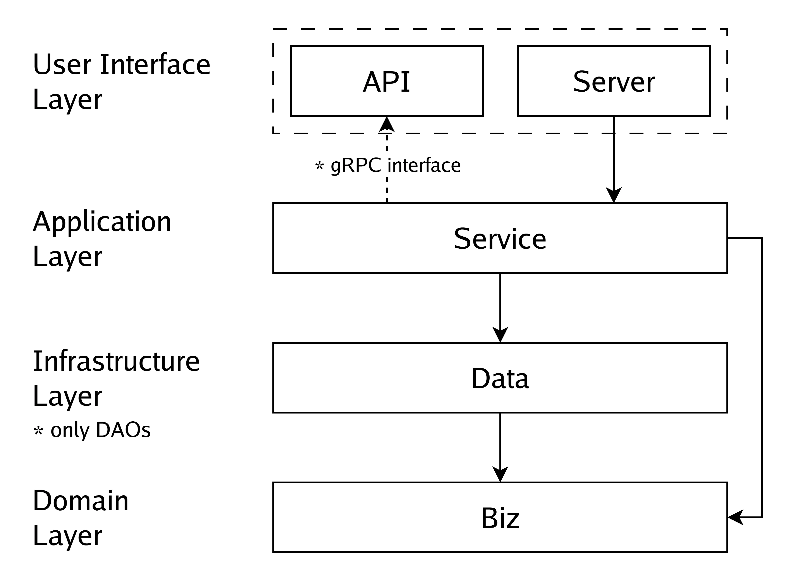

# Kratos Tutorial Template
This branch (`main`) is a template for creating a Kratos project. It has migrated to using `fx` as Dependency Injection framework since `wire` is no longer maintained.

Also, an alternative `make.py` is introduced for those who could not run Makefile (for example, Windows users).

- [Kratos Tutorial Template](#kratos-tutorial-template)
  - [Offcial guide](#offcial-guide)
    - [Install Kratos](#install-kratos)
    - [Create a service](#create-a-service)
    - [Generate other auxiliary files by Makefile](#generate-other-auxiliary-files-by-makefile)
    - [Generate other auxiliary files by `make.py`](#generate-other-auxiliary-files-by-makepy)
    - [Docker](#docker)
  - [DDD Guidelines](#ddd-guidelines)


## Offcial guide

### Install Kratos
```
go install github.com/go-kratos/kratos/cmd/kratos/v2@latest
```

### Create a service
```
# Create a template project
kratos new server

cd server
# Add a proto template
kratos proto add api/server/server.proto
# Generate the proto code
kratos proto client api/server/server.proto
# Generate the source code of service by proto file
kratos proto server api/server/server.proto -t internal/service

go generate ./...
go build -o ./bin/ ./...
./bin/server -conf ./configs
```

### Generate other auxiliary files by Makefile
```
# Download and update dependencies
make init
# Generate API files (include: pb.go, http, grpc, validate, swagger) by proto file
make api
# Generate all files
make all
```

### Generate other auxiliary files by `make.py`
A Python scripts is written to act as a cross-platform Makefile. Python 3 is required.
```
# Download and update dependencies
python make.py init
# Generate API files (include: pb.go, http, grpc, validate, swagger) by proto file
python make.py api
# Generate all files
python make.py all
```

### Docker
```bash
# build
docker build -t <your-docker-image-name> .

# run
docker run --rm -p 8000:8000 -p 9000:9000 -v </path/to/your/configs>:/data/conf <your-docker-image-name>
```

## DDD Guidelines

DDD (Domain-Driven Design) is a software design approach that focuses on modeling the domain of the problem being solved. The kratos framework makes use of DDD principles, with slightly changes.

- **api/**
  
  The package contains Protobuf definitions and generated code from `protoc`. It acts as the User Interface Layer in DDD.

- **internal/service**
  
  This package contains the implementations of Protobuf generated interfaces. It acts as the Application Layer in DDD.

- **internal/biz**
  
  This package contains the business logic. It acts as the Domain Layer in DDD.

The infrastructure layer in DDD is removed since Kratos has encapsulated a lot of work. Correspondingly, `internal/data` defines the ORM-related data structure, and `internal/server` configures the HTTP and gRPC server.

To start a new business, the steps are:

1. Write business logic in `internal/biz`.
2. Create Protobuf definitions and generate code in `api`.
3. Declare ORM-related data structure in `internal/data`, if any.
4. Implement Protobuf generated interfaces in `internal/service`.
5. Register the service in `internal/server`.

The dependency graph between packages is as below:

